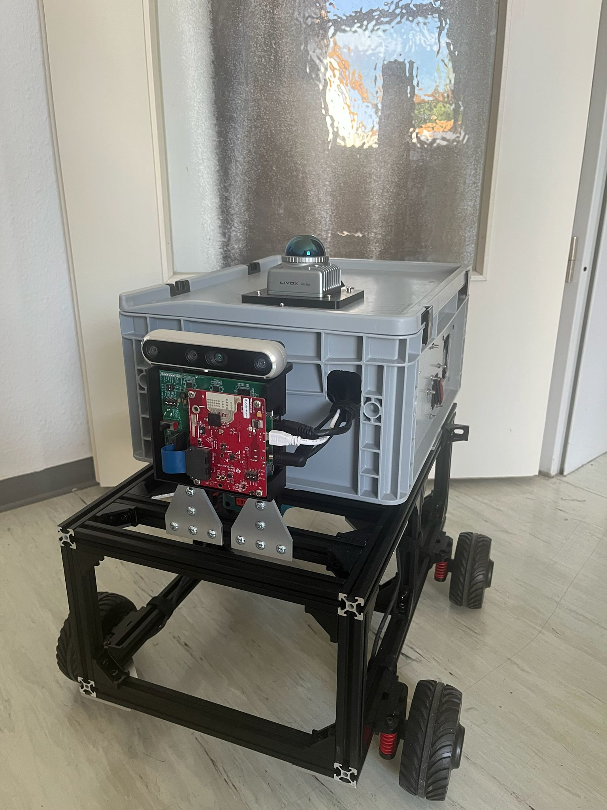

# Autonomous-Mobile-Robot

This project involves the development of an **Autonomous Mobile Robot** using multiple sensors for perception and navigation. The system is designed to operate autonomously in various environments, utilizing real-time sensor data for decision-making and path planning.

## Project Timeline
**Start Date:** June 2026  
**Current Status:** In Development

## Components

The following components are used in the development of the Autonomous Mobile Robot:

- **Livox Mid 360 LiDAR:** Provides 360-degree 3D scanning of the surrounding environment to detect objects and obstacles.
- **Intel Realsense d456:** Depth camera for capturing high-resolution depth data, enabling 3D mapping and perception.
- **TI AWR1843Boost Radar Sensor with DCA1000EVA FPGA board:** Radar sensor for robust object detection, even in low-visibility conditions (e.g., fog, dust).
- **Jetson Orin NX 16GB:** NVIDIA Jetson development platform that serves as the robot's primary computing unit, handling sensor data processing, AI computations, and control systems.

## Features
- **Multi-Sensor Fusion:** Combines data from LiDAR, Stereo Depth camera, and radar for improved perception and decision-making.
- **Real-Time 3D Mapping:** The robot constructs a 3D map of its environment using LiDAR or RGB-D data.
- **Autonomous Navigation:** The robot plans and follows its path based on sensor data, allowing it to move autonomously in complex environments by avoiding obstacles.

## Getting Started

### Prerequisites

Before setting up the project, make sure you have the following:

- **NVIDIA Jetson Orin NX 16GB** with JetPack SDK installed
- ROS2 installed on the Jetson platform
- Libraries and drivers for each sensor:
  - [Livox SDK](https://github.com/Livox-SDK/Livox-SDK2)
  - [Intel Realsense SDK](https://github.com/IntelRealSense/librealsense)
